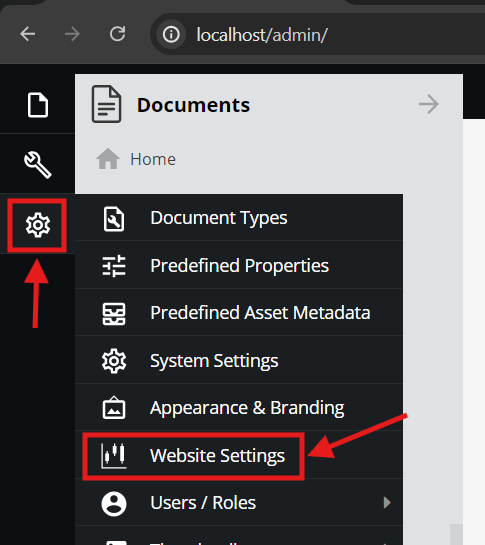
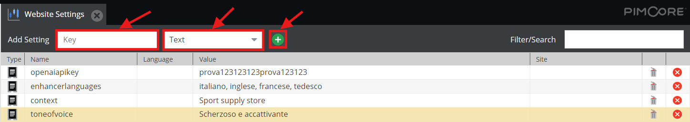
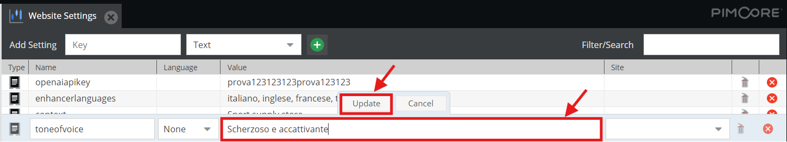
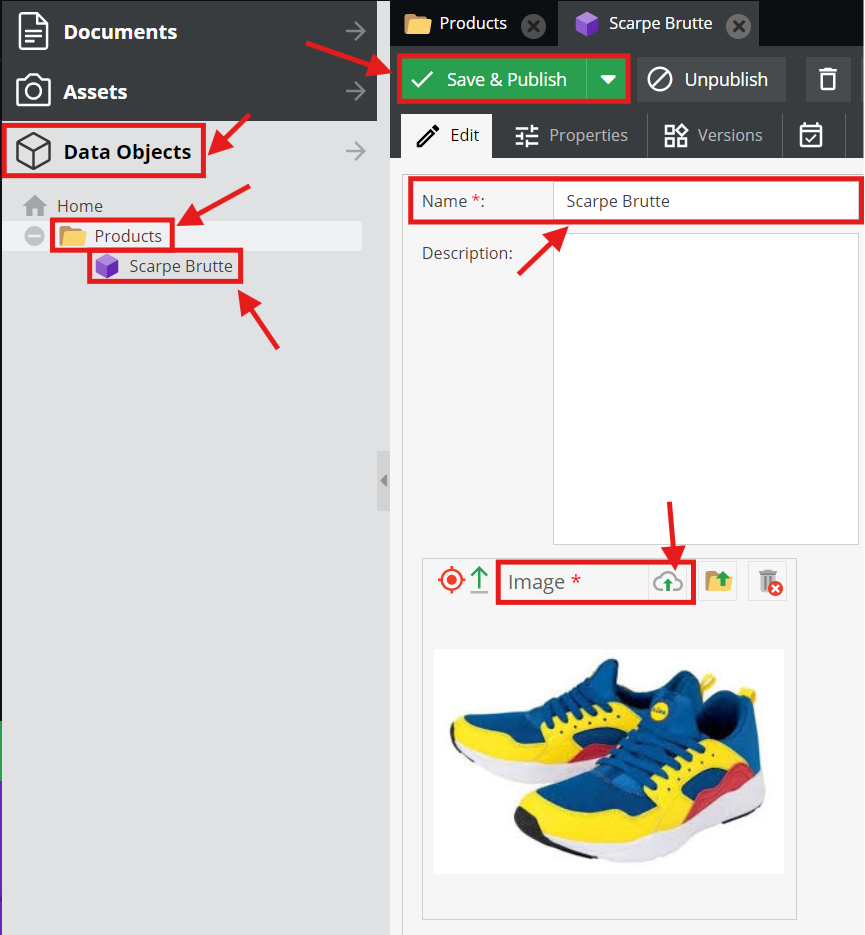
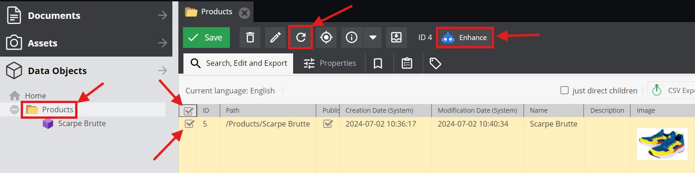
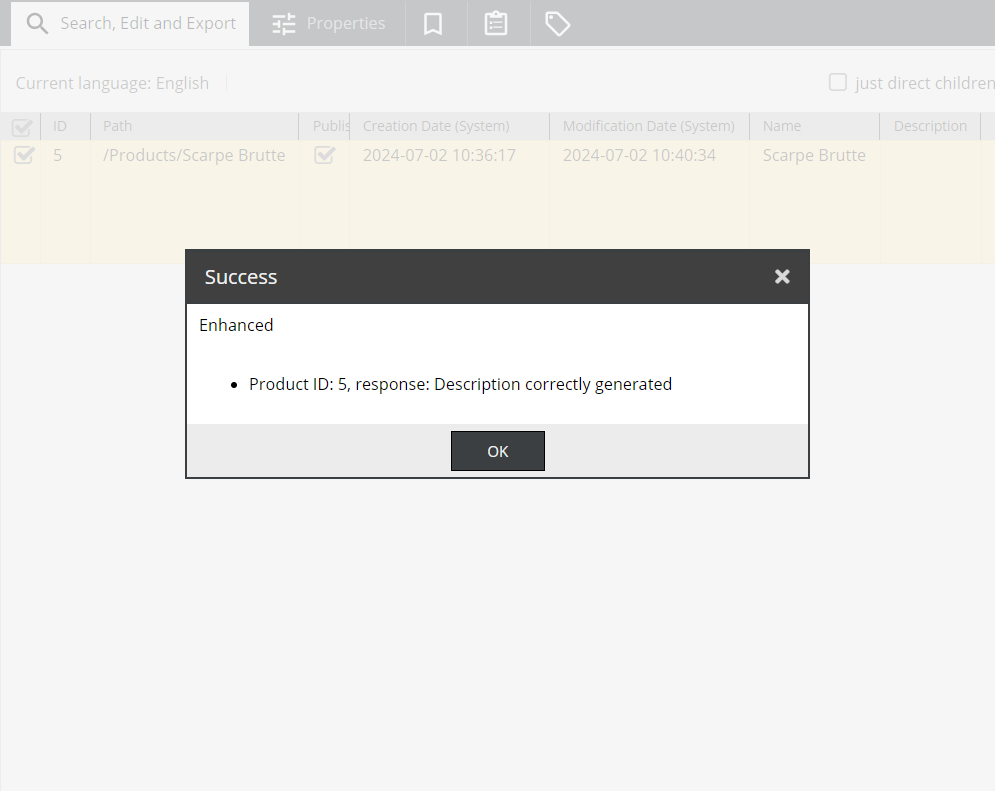

# Pimcore GPT Demo 


    
## Introduzione

Il bundle aggiunge alla classica interfaccia amministratore di pimcore, più precisamente nella toolbar delle cartelle Data Objects, la possibilità di generare tramite un modello LLM multimodale una descrizione del prodotto in base alla sua immagine. Questo procedimento è automatico, scalabile su grandi database di prodotti e personalizzabile tramite dei parametri configurabili del bundle che vanno a modificare il comportamento del modello.

## Installation
1. Scarica e apri la cartella della demo.
1. Aggiorna il file `docker-compose.yaml` eseguendo questo comando:

    ```bash
    sed -i "s|#user: '1000:1000'|user: '$(id -u):$(id -g)'|g" docker-compose.yaml
    ```
1. Avvia i container necessari alla demo, assicurati prima che non ci siano container pimcore già in esecuzione per evitare problemi di compatibilità:

    ```bash
    docker compose up -d
    ```
1. Installa le dipendenze necessarie:

    ```bash
    docker compose exec php composer install 
    ```
1. Installa pimcore configurando *nome utente* e *password* del utente amministratore, seleziona **no** alla richiesta di installare ulteriori bundle e infine seleziona **yes** per proseguire:

    ```bash
    docker compose exec php vendor/bin/pimcore-install --mysql-host-socket=db --mysql-username=pimcore --mysql-password=pimcore --mysql-database=pimcore
    ```
1. Nel browser accedi a http://localhost/admin e accedi con le credenziali impostate al passaggio precedente.
1. Apri il menù impostazioni nella barra laterale e seleziona **Website Settings**.

    

1. Creare le seguenti configurazioni inserendole una ad una nel campo **Key**, nel menù a tendina **Type** seleziona *Text* e premi sull'icona "+" (non copiare le virgolette):
    - "openaiapikey" 
    - "enhancerlanguages
    - "context"
    - "toneofvoice"

    

1. Per ogni voce inserire il valore pertinante nel campo *Value* e premere *Update*:
    - la configurazione **openaiapikey** come suggerisce il nome dovrà contenere la API Key per accedere ai servizi di OpenAI https://platform.openai.com/account/api-keys.
    - la configurazione **enhancerlanguages** dovrà essere un elenco separato da virgole di lingue nelle quali si vuole che il modello traduca le descrizioni (questo campo viene passato così come fornito al modello quindi la formattazione è poco importante purchè sia comprensibile a che lingue si fa riferimento).
    - la configurazione **context** ha lo scopo di fornire al modello il contesto in cui il prodotto dovrà essere venduto o comunque informazioni più generali su chi sta vendendo in modo da potersi adattare al meglio alle esigenze (questo campo viene passato così come fornito al modello quindi la formattazione è poco importante purchè sia comprensibile).
    - la configurazione **toneofvoice** ha lo scopo di impostare un tono di voce o uno "stile" che il modello dovrà utilizzare durante la generazione, per esempio possiamo dire al modello di essere scherzoso piuttosto che serio e professionale (questo campo viene passato così come fornito al modello quindi la formattazione è poco importante purchè sia comprensibile).

    

1. Aprire adesso la sezione **Data Objects** del interfaccia amministratore e creare una nuova cartella chiamandala *Product* o *Products* o *Prodotti*, per cartelle con altri nomi il bundle non sarà disponibile.
1. Al interno di questa cartella crea ora un oggetto di tipo *Product* (la cui classe è già definita nella demo) compilando i campi obbligatori *Nome* e *Image* caricando un'immagine in formato JPEG.

    

1. Premi adesso **Save & Publish**, apri nuovamente la cartella nella quale hai creato il prodotto e ricaricala.
1. Adesso seleziona il prodotto o i prodotti che si vogliono elaborare, premi il tasto **Enhance**, attendi la finestra che ti comunicherà che l'operazione è stata eseguita e ricarica la pagina per vedere il risultato aggiornato. (Durante l'elaborazione, al momento, non viene dato nessun feedback e i tempi di attesa variano in base alla quantità di prodotti selezionati, la velocità della rete locale e i tempi di risposta di OpenAI, attendere quindi pazientemente che appaina la finestra che attesta la fine del operazione).

    
    

## TODO

### IMPORTANTI
- [ ] Rendere distribuibile e installabile il bundle.
- [ ] Spostare configurazione del bundle da "Website Settings" ad un menù dedicato.
- [ ] Valutare l'affidabilità della libreria open source [openai-php/client](https://github.com/openai-php/client) utilizzata per le chiamate alle api di OpenAI ed eventualmente rimpiazarla con codice proprietario.
- [ ] Modificare `public/js/pimcore/startup.js` in modo che il caricamento delle modifiche al interfaccia avvenga con la stessa metodologia utilizzata negli altri bundle di Sintra, attualmente usa un metodo alternativo.
- [ ] Migliorare la gestione di errori ed eccezioni.
- [ ] Creare documentazione per il codice.

### FEATURES
- [ ] Aggiungere un feedback per l'utente in fase di attesa del termine delle operazioni.
- [ ] Aggiungere un operazione di refresh del interfaccia al termine delle operazioni così da mostrare subito il database aggiornato al utente.
- [ ] Aggiungere forzatura di output JSON da parte del modello e gestire le varie traduzioni ottenute in output.
- [ ] Testare e implementare il supporto di altri formati oltre al JPEG.

### OTTIMIZZAZIONE
- [ ] Valutare modelli alternativi a GPT-4o per costi e tempi di risposta. [Costri attuali](https://openai.com/api/pricing/). Alternative: [Gemini](https://ai.google.dev/gemini-api?hl=it), [Claude](https://www.anthropic.com/api), [Llama](https://llama.meta.com/llama3/).
- [ ] Testare ed eventualmente implementare la parallelizzazione delle chiamate alle api.
- [ ] Limitare la quantità di token che il modello può restituire in output per ogni chiamata in modo da ottimizare i costi.
- [ ] Valutare ed eventualmente implementare il downscaling delle immagini inviate al modello per ottimizare tempi e costi.
- [ ] Testare e modificare il limite di prodotti selezionabili da passare al bundle (attualmente impostato a 100 prodotti).
- [ ] Testare altre implementazioni di prompt base per ottenere migliori performance in tempi, costi e risultati.
